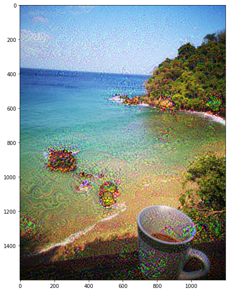

# **Googe Deep Dream in PyTorch**

---

In this lesson, we learn to implement the **Google Deep Dream Algorithm** using PyTorch. This method was first introduced by Alexander Mordvintsev from Google in July 2015.

It enables us to provide the 'Deep Dream' effect which produces hallucinogenic-like visuals. 

In this tutorial we:

1. Load Modules and pre-trained VGG Network
2. Get the output channels of a layer and run our Deep Dream algorithm
3. Improving Deep Dream by running it on different scales
4. Implement targeted Deep Dream

# Result 

