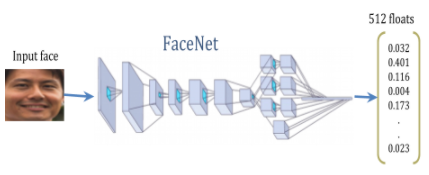
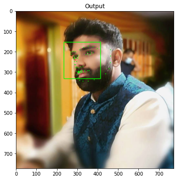
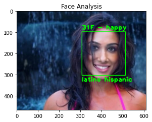

# **DeepFace - Age, Gender, Expression, Headpose and Recognition**

---

In this lesson, we use the **DeepFace API for Age, Gender, Expression Facial and Recognition. We even use the headpose library to obtain head direction/tilt**. DeepFace is an easy to use python module that provides access to several Facial Detection and Recognition models. It's very simple to use to let's dive in.

1. Install the necessary modules and download our files
2. Demonstrate facial landmarks
3. Obtain Age, Gender, Emotional Expression and Ethnicity using DeepFace
4. Perform Facial Similarity
5. Perform Facial Recognition

# Model

FaceNet is a deep Neural Network used for extracting features from an image of a face.

FaceNet takes an image of a face as input and outputs a vector of 512 numbers, which represents the most important features of a face. In machine learning, this vector is called embedding.

Ideally, embeddings of similar faces are also similar. Mapping high-dimensional data (like images) into low-dimensional representations (embeddings) has become a fairly common practice in machine learning.

Embedding are vectors, and vectors can be seen as points in a Cartesian coordinate system. That means we can plot an image of a face as a point in the coordinate system using its embedding. Two similar faces should be two points that are close to each other. Thus, one possible way of recognizing a person in a new image (unseen previously) would be to calculate the embedding of this person’s face, calculate the distances to the embeddings of faces of known people, and when the distance is close enough to the embedding of person X, we say that this image contains the face of person X.

Having a dataset of face images, with multiple images for each person, FaceNet can be trained as follows:

    Randomly select an anchor image.
    Randomly select an image of the same person (positive example).
    Randomly select an image of a different person (negative example).
    Adjusts the FaceNet network parameters so that the positive example is closer to the anchor than the negative example.

We repeat these steps until there are no more changes to be done, that means all the faces of the same person are close to each other and far from others. This method of learning with anchor, positives and negatives examples is called triplet loss.

# Result 

